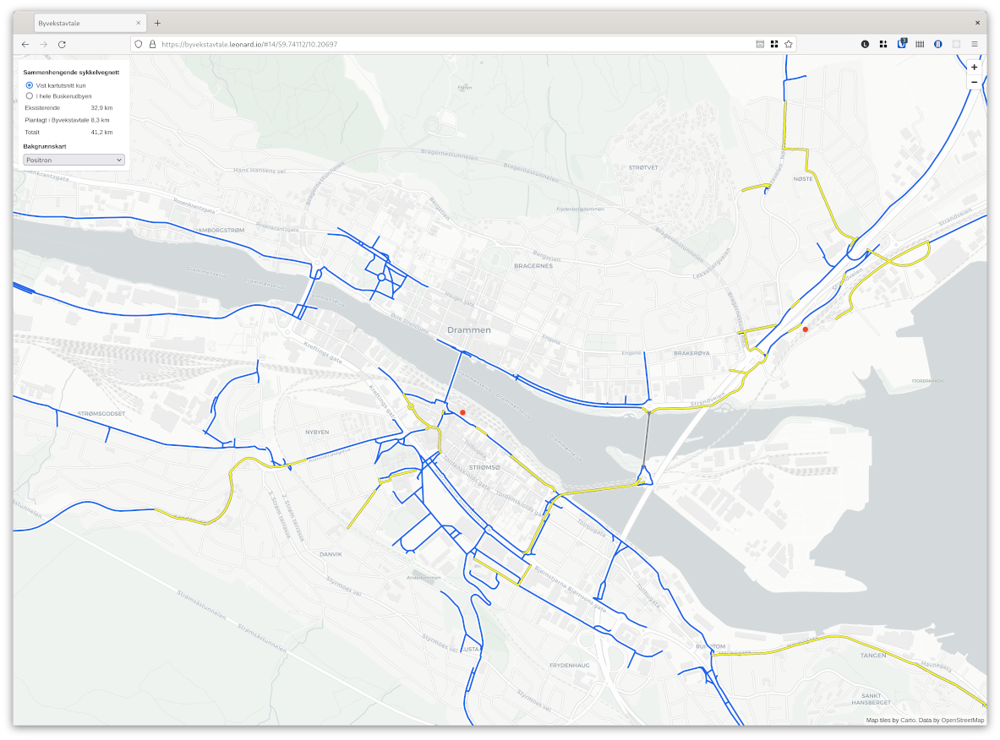
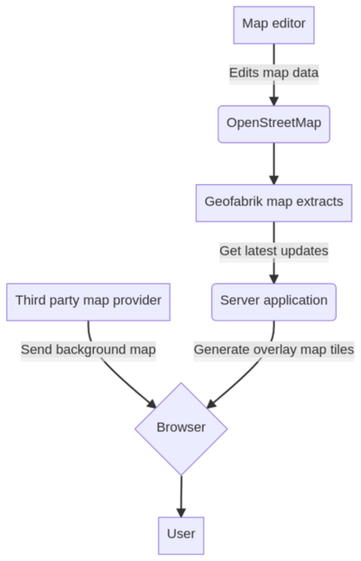

# Buskerudbyen bicycle infrastructure proposal visualizer

Web application to visualize and measure the length of existing and proposed
infrastructure in the municipality of Buskerudbyen.

[Live map](https://byvekstavtale.leonard.io/)

## Technical overview

Generating the map data contains of the the following chain:

1. A map editor edits the map on the central OpenStreetMap instance
1. Geofabrik, an external service, produces a fresh extract for Norway (among many other regions)
   every night.
1. `osmium` updates the local copy of the Norway extract and extracts the various map layers (existing, planned, ...)
1. `tippecanoe` combines all of these extracts into vector map tile files in pbf format
1. `apache` serves the map tiles together with the frontend code
1. A small Python + flask application provides the calculation of distances of the bicycle lanes.

### Diagram

## Repository organization

- `ansible` contais the server-side code, including the ansible provision scripts for a Debian 11 host, 
  which updates the Norway OSM extract and generates the map tiles.
- `ui` contains the frontend code tying together all datasources and displaying
  them on a browser map

## Deployment commands

- `make ansible` provisions the server and deploys the server-side code
- `make deploy` copies the frontend files to the server where Apache serves it

## Getting the data into OpenStreetMap

### Community involvement

This is a delicate operation: Adding data about planned features, which by 
definition are not visisble yet, is a little controversial in the OSM world.

Please consult with your local chapter to discuss a way forward as 
[Buskerudbyen has done](https://forum.openstreetmap.org/viewtopic.php?id=73924).

### Creating a tagging scheme

In the case of Buskerudbyen we decided that we need to tag three categories of 
cycling infrastructure:

- Existing ones
- Planned ones
- Externally financed ones

After having consulted with the community we decided to use the tagging scheme
[`buskerudbyen:cycleway`](https://wiki.openstreetmap.org/wiki/Key:buskerudbyen:cycleway).

## Further questions

If you would like to know more details please reach out to 

- Trond Solem, Cycling Manager Buskerudbyen: [Trond@buskerudbyen.no](mailto:Trond@buskerudbyen.no)
- Leonard Ehrenfried, Software consultant: [mail@leonard.io](mailto:mail@leonard.io)

